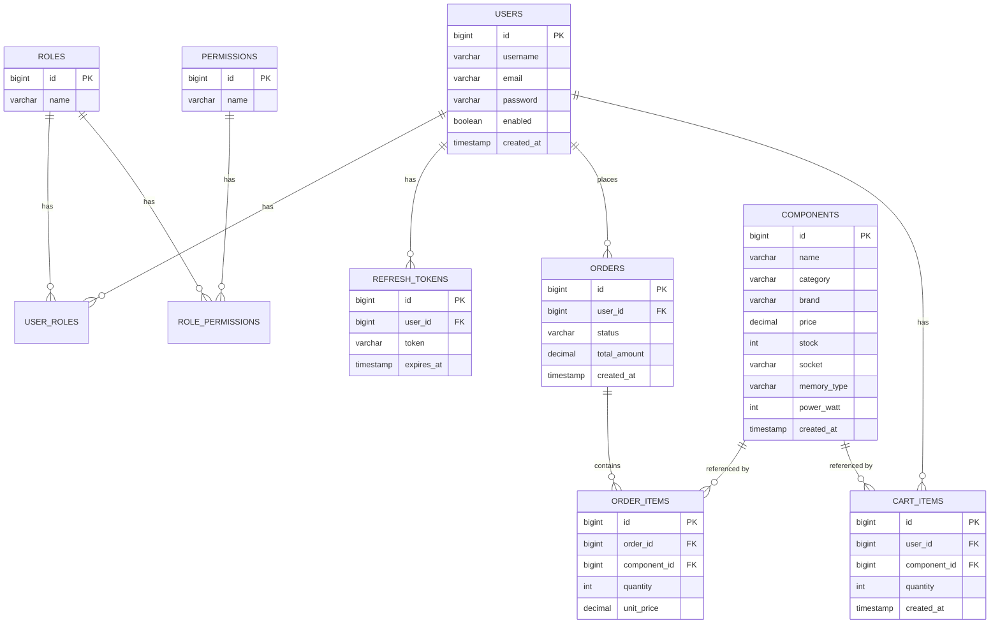

# 🖥️ 電腦組裝商城（含相容性檢查）

期末專題 —— 一個支援零件瀏覽、下單、CPU/主機板相容性驗證、管理者後台的電商後端系統。

技術棧：**Java 25 · Spring Boot 4.0.6 · PostgreSQL 15 · Flyway · Spring Security 7（JWT）· jjwt 0.12.6 · Lombok · springdoc-openapi 3.0.1**

---

## 📌 核心功能

- **會員系統**：JWT 註冊 / 登入 / refresh token 輪換 / 登出
- **零件管理**：CPU、主機板、GPU、PSU 等零件的 CRUD，可依分類查詢
- **購物車系統**：加入 / 查詢 / 更新數量 / 移除單一項目 / 清空購物車，重複加入同一零件會自動疊加數量，不會產生重複紀錄
- **下單系統**：下單時檢查庫存、計算總金額，整個流程包在 `@Transactional` 內，確保資料一致性
- **相容性檢查（本專題技術亮點）**：獨立成 `CompatibilityService`，目前涵蓋兩條規則——① CPU 與主機板的 socket 是否相符 ② RAM 與主機板的記憶體類型（DDR4/DDR5）是否相符。偵測到不相容時**不會直接擋單**，而是回傳 `409` 搭配明確的警告訊息；使用者可在請求裡加上 `confirmIncompatible: true` 表示已知悉風險並堅持購買，此時才會建立訂單。這個設計比單純擋單更貼近真實電商的使用者體驗（保留使用者的最終決定權），規則之間互相獨立，新增規則只需要在 `check()` 方法裡多加一段判斷
- **權限分級**：一般使用者（USER）與管理者（ADMIN）分開的 API 權限——管理者可查看所有訂單、更新訂單狀態，一般使用者只能查看自己的訂單
- **統一錯誤格式**：所有例外（驗證失敗、找不到資源、庫存不足等）都經過 `@RestControllerAdvice` 統一處理，回傳一致的 JSON 格式，不會有裸露的 500 stack trace

---

## ⚡ 本機啟動步驟

### 1. 準備資料庫（PostgreSQL 容器）

```bash
docker run -d --name my_postgres \
  -e POSTGRES_PASSWORD=my_secret_password \
  -p 5433:5432 postgres:15

docker exec my_postgres psql -U postgres -c "CREATE DATABASE starter_db;"
```

### 2. 啟動專案

```bash
./mvnw spring-boot:run
```

看到 `Started StarterApplication` 即成功。Flyway 會依序執行以下 migration，自動建好所有資料表：

- `V1__auth_schema.sql`：會員、角色、權限、refresh token 相關表
- `V2__create_components.sql`：零件表
- `V3__create_orders.sql`：訂單、訂單明細表
- `V4__create_cart_items.sql`：購物車表
- `V5__add_memory_type.sql`：零件表補上 `memory_type` 欄位(記憶體相容性檢查用)

### 3. 開啟 Swagger UI 測試 API

```
http://localhost:8080/swagger-ui/index.html
```

測試流程：
1. 展開 `POST /api/auth/login`，填入帳密送出，複製回應裡的 `accessToken`
2. 點右上角 **Authorize** 按鈕，貼上 token
3. 之後即可直接在頁面上測試所有需要登入的 API

---

## 📋 API 清單

| 方法 | 路徑 | 說明 | 權限 |
|---|---|---|---|
| POST | `/api/auth/register` | 註冊 | 公開 |
| POST | `/api/auth/login` | 登入 | 公開 |
| POST | `/api/auth/refresh` | 刷新 token（含輪換機制） | 公開 |
| GET | `/api/components` | 查詢零件（可用 `?category=` 篩選） | 公開 |
| GET | `/api/components/{id}` | 查詢單一零件 | 公開 |
| POST | `/api/components` | 新增零件 | 需登入 |
| PUT | `/api/components/{id}` | 更新零件 | 需登入 |
| DELETE | `/api/components/{id}` | 刪除零件 | 需登入 |
| GET | `/api/cart` | 查詢購物車 | 需登入 |
| POST | `/api/cart/items` | 加入購物車（同零件會疊加數量） | 需登入 |
| PUT | `/api/cart/items/{componentId}` | 更新購物車項目數量 | 需登入 |
| DELETE | `/api/cart/items/{componentId}` | 移除購物車單一項目 | 需登入 |
| DELETE | `/api/cart` | 清空購物車 | 需登入 |
| POST | `/api/orders` | 下單(含相容性檢查、庫存扣減)；相容性有問題且未帶 `confirmIncompatible: true` 時回傳 `409` 警告。成功建單的回應每個項目都包含完整零件資訊(`category`/`socket`/`memoryType`/`powerWatt`),值為 null 的欄位不會出現在回應裡 | 需登入 |
| GET | `/api/orders/mine` | 查詢自己的訂單 | 需登入 |
| GET | `/api/admin/orders` | 查詢所有訂單 | ADMIN |
| PATCH | `/api/admin/orders/{id}/status` | 更新訂單狀態 | ADMIN |

---

## 🧪 測試帳號設定

先註冊一般帳號：

```bash
curl -X POST http://localhost:8080/api/auth/register \
  -H "Content-Type: application/json" \
  -d '{"username":"test1","email":"test1@example.com","password":"password123"}'
```

若要測試管理者權限，進資料庫手動綁定角色：

```sql
INSERT INTO user_roles (user_id, role_id)
SELECT u.id, r.id FROM users u, roles r
WHERE u.username = 'test1' AND r.name = 'ROLE_ADMIN';
```

角色資訊寫在 JWT 裡，綁定後要**重新登入**才會拿到含 `ROLE_ADMIN` 的新 token。

---

## 🗂️ 資料庫 ERD

- `users` 與 `roles` 是多對多關係(透過 `user_roles`)
- `roles` 與 `permissions` 是多對多關係(透過 `role_permissions`)
- 一個 `user` 可以有多筆 `refresh_tokens`、多筆 `orders`、多筆 `cart_items`
- 一筆 `order` 可以包含多筆 `order_items`,每筆 `order_item` 對應一個 `component`
- `cart_items` 對每個使用者的每個零件只會有一筆紀錄(`user_id` + `component_id` 唯一),重複加入同一零件是累加 `quantity`,不是新增資料列



## ⚠️ 已知限制 / 未實作項目

- **Redis 快取、Docker Compose 一鍵部署**：受限於開發時間，本次未實作，是後續可優化方向
- **相容性檢查**目前涵蓋 CPU/主機板 socket、RAM/主機板記憶體類型兩條規則，可繼續擴充方向：PSU 瓦數是否足夠支撐整套零件、機殼是否支援主機板尺寸。`CompatibilityService` 回傳警告清單的架構已經是可擴充設計，新增規則只需要在 `check()` 方法裡多加一段判斷、疊加進 `warnings` 清單即可
- **購物車不會檢查相容性**：相容性檢查目前只發生在「送出訂單」的當下，購物車階段可以自由加入任何零件組合，這是刻意的設計（先讓使用者自由挑選，結帳時才提醒），但如果要在購物車階段就即時提示，也可以呼叫 `CompatibilityService` 做到

---

## 💣 開發踩坑紀錄（附錄）

| # | 坑 | 症狀 | 解法 |
|---|----|------|------|
| 1 | 新 Entity 沒寫 migration | 啟動就爆 `missing table` | `ddl-auto` 是 `validate`，每張新表都要有 `V<n>__*.sql` |
| 2 | `GenerationType.AUTO` | 啟動爆 `missing sequence` | 一律用 `IDENTITY` |
| 3 | Service 有更新/刪除邏輯沒加 `@Transactional` | 第一次能動、第二次才爆 | 涉及多步驟資料庫操作的方法加 `@Transactional` |
| 4 | Entity 用 `@Builder` + 欄位初始值 | builder 建出來欄位是 null，INSERT 撞 NOT NULL | 初始值欄位加 `@Builder.Default` |
| 5 | Enum 欄位沒 `@Enumerated(EnumType.STRING)` | schema 驗證型別不符 | 加註解，DB 用 VARCHAR |
| 6 | 忘了在 SecurityConfig 放行公開 API | 前端一直 401/403 | 檢查 API 清單跟 SecurityConfig 規則是否一一對應 |
| 7 | Spring Security 過濾器層擋下的 403（例如 `hasRole` 不符）| 回應 body 是空的，不是自訂 JSON 格式 | 這類 403 發生在 filter chain，不會進到 `@RestControllerAdvice`；如需統一格式要另外設定 `AccessDeniedHandler` |
| 8 | 相容性檢查一開始用例外（`throw`）實作，直接擋單 | 使用者沒有機會「知情後仍要購買」，體驗生硬 | 把邏輯抽成獨立的 `CompatibilityService`，改成回傳 `List<CompatibilityWarning>`；Controller 依 `confirmIncompatible` 欄位決定要不要放行，例外處理跟業務邏輯分離 |
| 9 | 訂單回應把零件完整資訊（`socket`/`memoryType`/`powerWatt`）都攤平進同一個 Item DTO | CPU 沒有 `memoryType`、GPU 沒有 `socket`，這些不相關欄位會顯示一堆 `null` | 在 DTO 類別加 `@JsonInclude(JsonInclude.Include.NON_NULL)`，值為 null 的欄位直接不出現在回應 JSON 裡 |

---

## 🔄 常用指令

```bash
./mvnw spring-boot:run          # 啟動
./mvnw clean test-compile       # 編譯檢查
./mvnw clean package            # 打包

# 資料庫整個重來（會清光資料！Flyway 會重新從 V1 跑）
docker exec my_postgres psql -U postgres -c "DROP DATABASE starter_db;" -c "CREATE DATABASE starter_db;"

# 進資料庫看表
docker exec -it my_postgres psql -U postgres -d starter_db
```
